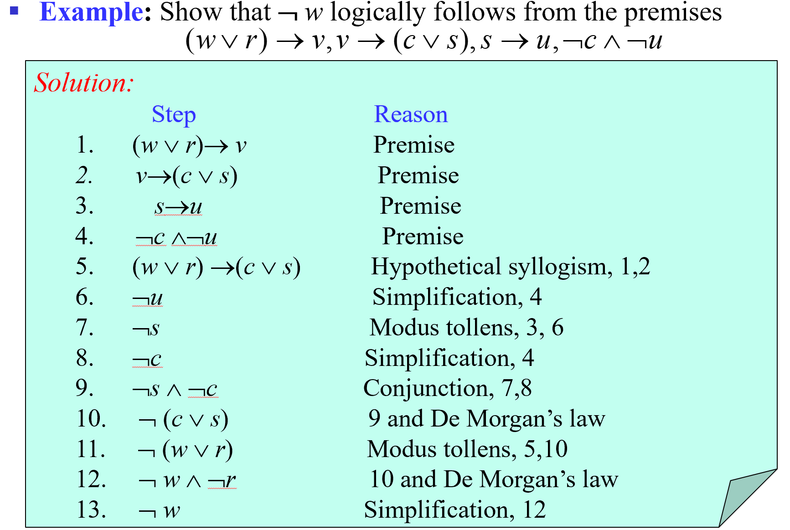
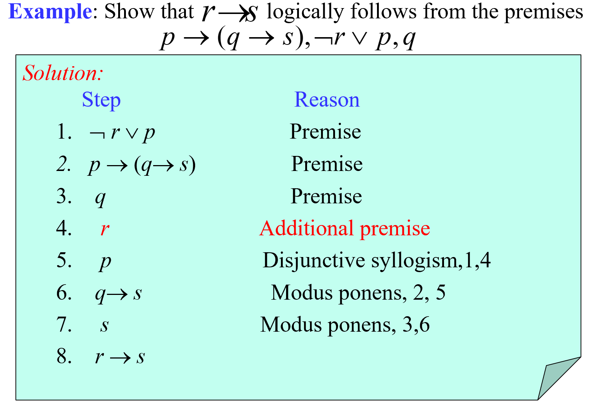
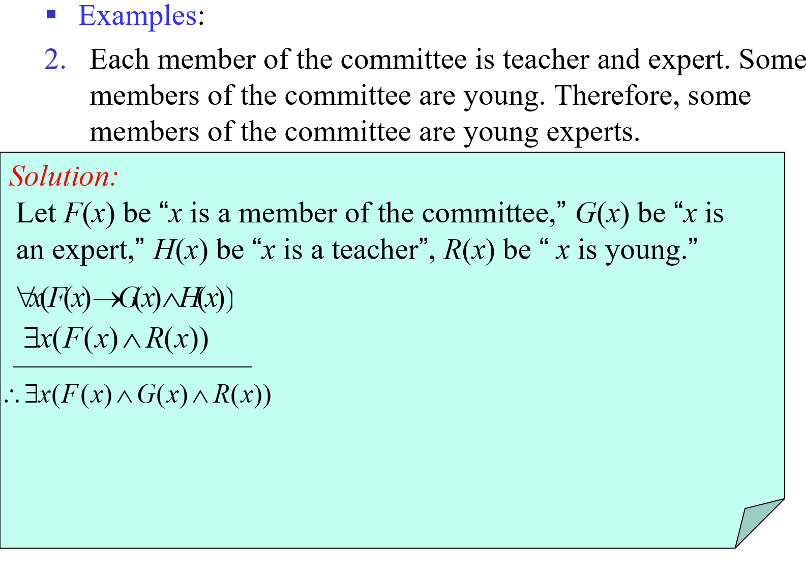
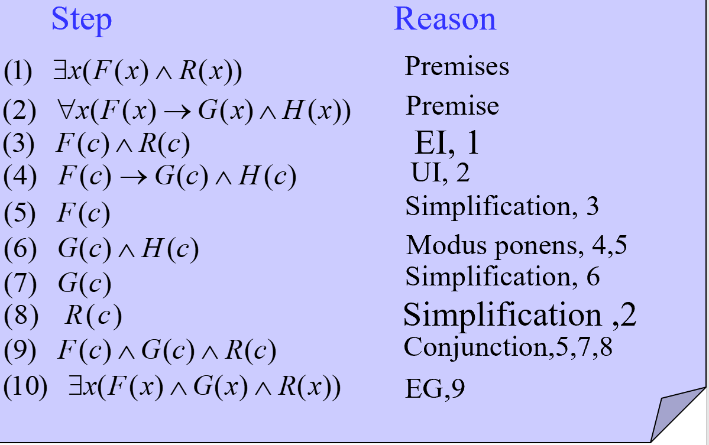
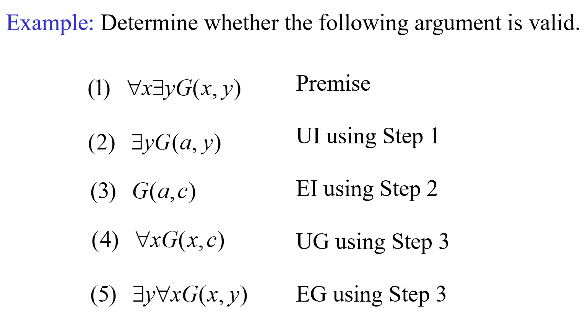

 Chapter 01 Logic and Proofs 逻辑与证明

Part 04

Covering 1.6~1.8

------

# Rules of Inference 推理规则

> Proofs in mathematics are ***valid arguments***
>
> An ***argument***（**论证**） is a sequence of statements that end with a conclusion
>
> By ***valid***（**有效性**）, we mean the conclusion must follow from the truth of the preceding statements (premises（**前提**）)

## Valid Arguments in Propositional Logic 命题逻辑的有效论证

An **argument** in propositional logic is a sequence of  propositions. 

All but the final proposition in the argument are called **premises** and the final proposition is called the **conclusion**. 

**An argument** **is** **valid** if the truth of all its premises implies that the conclusion is true.

An **argument form**（**论证形式**） in propositional logic is a sequence of compound propositions involving propositional variables.

**An argument form is valid** if no matter which particular propositions are substituted for the propositional variables in its premises, the conclusion is true if the premises are all true. 

$$p_1\\p_2\\...\\p_n\\-\\\therefore q$$

An argument in propositional logic is valid when **its argument form is valid**.

e.g.

## Rules of Inference 推理原则

### Rules of Inference for Propositional Logic 命题逻辑的推理原则

|       Rule of Inference       |            Tautology             |                             Name                             |
| :---------------------------: | :------------------------------: | :----------------------------------------------------------: |
|     $$p\\p\to q\\ --- \\\therefore q$$     |       $$(p\wedge (p\to q))\to q$$       |                    Modus ponens 假言推理                     |
|    $$\neg q\\p\to q\\---\\\therefore\neg p$$    |       $$(\neg q\wedge(p\to q))\to\neg p$$       |                     Modus tollens 取拒式                     |
| $$p\to q\\q\to r\\---\\\therefore p\to r$$ | $$((p\to q)\wedge(q\to r))\to (p\to r)$$ |              Hypothetical syllogism 假言三段论               |
|     $$p\vee q\\\neg p\\---\\\therefore q$$     |        $$((p\vee q)\wedge\neg p)\to q$$        |               Disjunctive syllogism 析取三段论               |
|       $$p\\---\\\therefore p\vee q$$       |          $$p\to (p\vee q)$$          |                       Addition 附加律                        |
|       $$p\wedge q\\---\\\therefore p$$       |          $$(p\wedge q)\to p$$          |                    Simplification 化简律                     |
|     $$p\\q\\---\\\therefore p\wedge q$$     |     $$((p)\wedge(q))\to(p\wedge q)$$     |                      Conjunction 合取律                      |
| $$p\wedge q\\\neg p\vee r\\---\\\therefore q\vee r$$ | $$((p\vee q)\wedge(\neg p\vee r))\to (q\vee r)$$ | Resolution 消解律（**Pay Attention!**This rule has been used widely in many programmes） |

> ***A valid argument can lead to an incorrect conclusion if one of its premises is wrong/false!***

#### Resolution 消解律

> Computer programs have been developed to automate the task of reasoning and proving theorems. Many of these programs make use of a rule of inference known as resolution. This rule of inference is based on the tautology
>

$$((p\vee q)\wedge (\neg p\vee r))\to(q\vee r)$$

The final disjunction in the resolution rule, $$q\vee r$$, is called the **resolvent**（消解式）

> Resolution is very important in AI!

### Rules of Inference for Quantified Statements 量化命题的推理规则

|                      Rule of Inference                       |                Name                 |
| :----------------------------------------------------------: | :---------------------------------: |
|           $$\forall xP(x)\\---\\\therefore P(c)$$            |  Universal instantiation 全称实例   |
| $$P(c) for\ an\ arbitrary\ c\\----------\\\therefore\forall xP(x)$$ |  Universal generalization 全称引入  |
| $$\exists xP(x)\\------------\\\therefore P(c)\ for\ some\ element\ c$$ | Existential instantiation 存在实例  |
| $$P(c)\ for\ some\ element\ c\\-----------\\\therefore\exists xP(x)$$ | Existential generalization 存在引入 |

### Combining Rules of Inference for Propositions and Quantified Statements 命题和量化命题的组合使用

#### Universal Modus Ponens 全称假言推理

$$\forall x(P(x)\to Q(x))\\P(a),\ where\ a\ is\ a\ particular\ element\ in\ the\ domain\\------------------------\\\therefore Q(a)$$

#### Universal Modus Tollens 全称取拒式

$$\forall x(P(x)\to Q(x))\\\neg Q(a),\ where\ a\ is\ a\ particular\ element\ in\ the\ domain\\------------------------\\\therefore\neg P(a)$$

## Using Rules of Inference to Build Arguments 使用推理规则建立论证

> To prove that an argument is valid
>
> - Assume the premises are true
>
> - Use the rules of inference and logical equivalences to determine that the conclusion is true

### e.g.1 Propositional Logic 命题逻辑

**Note**: the second example added an additional premise for the conclusion is always true when r is false, so all we need to proove if that it's true when r is true!

**Note**: If the conclusion is given in a form of $$p\to q$$ , we can convert the argument $$p_1\wedge p_2\wedge ...\wedge p_n\to(p\to q)$$ to $$p_1\wedge p_2\wedge...\wedge p_n\wedge p\to q$$ , because they are logically equivalent

### e.g.2 Quantified Statements 量化命题

### e.g.3 Combination 组合使用

***Invalid!!!***

For **c** depends on **a**!

## Fallacies 谬误

Several common fallacies arise in incorrect arguments. These fallacies resemble rules of inference,
but are based on contingencies rather than tautologies.

### Fallacy of denying the hypothesis 否定假设的谬误

> If you overslept, you’ll be late.
>
> You didn’t oversleep.
>
> Therefore: You aren’t late.

**WRONG!!**

$$p\to q\\\neg p\\---\\\therefore\neg q$$

### Fallacy of affirming the conclusion 肯定结论的谬误
> If you are in China, you’re in Asia.
>
> You are in Asia.
>
> Therefore: You are in China.

**WRONG!!**

$$p\to q\\q\\---\\\therefore p$$

# Introduction to Proofs 证明导论

> The construction of a valid proof is an art, honed after much practice.

## Some Terminology 一些专业术语

A **proof**（**证明**） is a valid argument that establishes the truth of a mathematical statement

A **theorem**（**定理**） (**proposition**（命题）/**fact**（事实）/**result**（结论）) is a statement that can be shown to be true

**Axioms**（公理） (**postulates**（假设）) are statements we assume to be true

A **lemma**（引理） is a less important theorem that is helpful in the proof of other results

A **corollary**（推论） is a theorem that can be established directly from a theorem that has been proved

A **conjecture**（猜想） is a statement that is being proposed to be a true statement

> ***A conjecture becomes a theorem once it has been proved to be true***

## Understanding How Theorems Are Stated 理解定理是如何陈述的

### Implied Universal Quantifiers 隐含全称量词

e.g.

“if *x*>*y*, where x and y are positive real numbers, then $$x^2>y^2​$$.”

**For all positive real numbers *x* and *y***, if *x*>*y*, then $$x^2>y^2​$$.

### Implicit Implications 暗示关系

e.g.

“The square of an odd integer is odd.”

“**if** an integer *n* is odd, **then** $$n^2$$ is odd.”

 “**For all integer *n***, if *n* is odd, then $$n^2$$ is odd.”

## Methods of Proving Theorems 证明方法

### Formal Proofs 形式化证明

- Can be extremely long

- May be hard to follow

### Informal Proofs 非形式化证明

- Each step may involve multiple rules of inference;

- Steps may be skipped;

- The axioms being assumed and the rules of inference used are not explicitly stated. 

## Mistakes in Proofs 证明中的错误

Many mistakes result from the introduction of steps that do not logically follow from those that precede it.

Many incorrect arguments are based on a fallacy called ***begging the question*** (**circular reasoning**（**循环论证**）)

# Proof Methods 证明方法

## Direct Proofs 直接证明

A direct proof shows that a conditional statement p → q is true by showing that if p is true, then q must also be true

## Indirect Proofs 间接证明

### Proof by Contraposition 反证法

$$P\to Q\equiv\neg Q\to\neg P$$

#### Vacuous Proof 空证明

If we know *P* is false then  *P* → *Q* is ***vacuously*** true.

F → T and F → F are both true.

> e.g. If Tom is both handsome and ugly then he feels unhappy.

#### Trivial Proof 平凡证明

If we know *Q* is true, then *P* → *Q* is ***trivially*** true

F → T and T → T are both true.

> e.g. If it’s raining today then the empty set is a subset of every set.

### Proof by Contradiction 归谬证明法

$$\neg p\to(q\wedge\neg q)$$

直接的说，就是先假设p为假，然后推出两个相矛盾的结论

它与反证法的差别就在于反证法是找到与假设相悖的结论，而归谬证明法是由假设推出两个相悖的结论，即**矛盾的产生处不同**

> **Example**:
>
> Prove there is no largest prime number.
>
> **Proof**:
>
> Let *p* be the proposition “there is no largest prime number.”
>
> Assume that ¬*p* is true, namely, there is a largest prime number, denoted by *s*.
>
> Hence, the set of all primes lie between 2 and *s*. 
>
> Form the product of these primes:
> $$
> r=2×3×5×7×11×…×s
> $$
> But *r* + 1 is a prime or has a prime factor larger than s. 
>
> This is a contradiction since we have shown that ¬*p* implies both *q* and ¬*q* where *q* is the statement that *s* is the largest prime number.
>
> Hence, ¬*p* is false, so that *p*, “there is no largest prime number,” is true. 
>
> Q.E.D.

#### Proof  *p* → *q* by Contradiction 运用归谬证明法证明蕴含关系

1. assumes that both *p* and *¬q* are true

2. shows that $$(p\wedge\neg q)\to F$$

#### Proofs of Equivalence by Contradiction 运用归谬证明法的等价证明法

$$p\leftrightarrow q\equiv(p\to q)\wedge(q\to p)$$

$$[p_1\leftrightarrow p_2\leftrightarrow...p_n]\equiv[(p_1\to p_2)\wedge(p_2\to p_3)\wedge...\wedge(p_n\to p_1)]$$

### Counterexamples 反例证明法

When presented with a statement of the form ∀xP(x), which we believe to be false or which has resisted all proof attempts, we look for a counterexample.

## Proof by Cases 分情形证明法

就是分类讨论

**Notice**:

You have to ——

- Convince the reader that the cases are inclusive (i.e., they exhaust all possibilities)
- Establish all implications

> **Example**:
>
> Prove that if *n* is an integer not divisible by 2 or 3, then *n*2-1 is divisible by 24.
>
> **Solution**:
>
> - *n* = 6*k*+1
>
> - *n* = 6*k*+5

## Exhaustive Proof 穷举证明法

An ***exhaustive proof*** is a special type of proof by cases where each case involves checking a single example

> **Example**:
>
> Show that there are no solutions in integers *x* and *y* of $$x^2 + 3y^2=8$$
> $$
> x = -2,-1,0,1,2
> $$
>
> $$
> y = -1,0,1
> $$
>
> By exhausting every possible situation, we can draw the conclusion that this pair of x and y does not exist.

## Existence Proof 存在性证明

### Constructive Existence Proof 构造性证明

1. Establish *P*(*c*) is true for some *c* in the domain
2. Then ∀xP(x) is true by Existential Generalization (EG)

> **Example**:
>
> Show that there are *n* consecutive composite positive integers for every positive integer *n*
>
> **Explanation**:
>
> $$\forall n\exists x((x+i)\ is\ composite\ for\ i\ = 1,2,...,n)$$
>
> **Proof**:
>
> Let *x* = (*n* + 1)! + 1.
>
> Consider the integers x + 1, x + 2, … , x + n. 
>
> Note that i + 1 divides $$x + i = (n + 1)! + (i + 1)\ for\ i = 1, 2, … , n​$$
>
> Hence, *n* consecutive composite positive integers have been given. 
>
> Q.E.D.

### Nonconstructive Existence Proof 非构造性证明

Assume no *c* exists which makes *P*(*c*) true and derive a contradiction 

> **Example**:
>
> Prove that for all integers *n*, there exists a prime *p* so that *p* > *n*
>
> **Proof**:
>
> Let *n* be an arbitrary integer, and consider *n*! + 1.  
>
> - If (*n*! + 1) is prime, we are done since (*n*! + 1) > *n*.  
>
> - But what if (*n*! + 1) is composite?
>
>   If (*n*! + 1) is composite then it has a prime factorization:
>   $$
>   p_1×p_2×…×p_k=(n!+1)
>   $$
>   Consider the smallest $$p_1$$, it is still larger than n
>
>   Let *p =* $$p_1$$ , then  *p* > *n*, and we are done.  
>
> Q.E.D.
>
> **Note**:
>
> WE STILL DON’T KNOW WHAT *p* IS!!!

## Uniqueness Proof 唯一性证明

There are two parts of a *uniqueness proof*:

- ***Existence***: We show that an element *x with* the desired property exists.
- ***Uniqueness*** : We show that if *y*¹*x*, then *y* does not have the desired property. Equivalently, we can also show that if *x* and *y* both have the desired property, then *x*=*y*.

> **Example**:
>
> Show that if *a* and *b* are real numbers and *a* ≠ 0, then there is a unique real number *r* such that $$ar+b=0$$
>
> **Proof**:
>
> - **Existence**:  Note that the real number $$r = -b/a$$ is a solution of $$ar + b = 0$$ because $$a(-b/a)+b=-b+b=0$$. Thus, a real number *r* exists for which $$ar + b = 0$$.
>
> - **Uniqueness**: suppose that *s* is a real number such that $$as + b = 0$$. Then $$as + b = ar + b$$, where $$r = -b/a$$. Subtracting *b* from both sides, we find that *as* = *ar*. Dividing both sides of this last equation by *a*, which is nonzero, we see that *s* = *r*. 
>
> Q.E.D. 

# Proof Strategies 证明策略

## Forward Reasoning 正向推理

Using  premises, together with axioms and known theorems to lead to the conclusion. 

> **Example**:
>
> Given two distinct positive real numbers *x* and *y*, their arithmetic mean is $$(x+y)/2$$ and their geometric mean is $$\sqrt{xy}$$, the arithmetic mean is always greater than the geometric mean.
>
> **Note**:
>
> if you start from $$(x+y)^2≥0$$, then it's **forward reasoning**
>
> if you start from $$(x+y)/2>\sqrt{xy}$$, which is the conclusion, then it's **backward reasoning**, the strategy which we will talk about right below here.

## Backward Reasoning 反向推理

To reason backward to prove a statement *q*, we find a statement *p* that we can prove with the property that *p* → *q*.

> **Example**:
>
> Suppose that two people play a game taking turns removing, 1, 2, or 3 stones at a time from a pile that begins with 15 stones. The person who removes the last stone wins the game. Show that the first player can win the game no matter what the second player does.
>
> **Proof**:
>
> - **Step n**   : Player1 can win if the pile contains 1,2, or 3 stones. 
>
> - **Step n-1**: Player2 will have to leave such a pile if the pile that he/she is faced with has 4 stones. 
>
> - **Step n-2**: Player1  can leave 4 stones when there are 5,6, or 7 stones left at the beginning of his/her turn. 
>
> - **Step n-3**: Player2  must leave  such a pile, if there are  8 stones.
>
> - **Step n-4**: Player1 has to have a pile with 9,10, or 11 stones to ensure that there are 8 left. 
>
> - **Step n-5**: Player2  needs to be faced with  12 stones to be forced to leave 9,10, or 11. 
>
> - **Step n-6**: Player1  can leave  12 stones by removing 3 stones. 
>
>  Now reasoning forward, the first player can ensure a win by removing 3 stones and leaving 12.