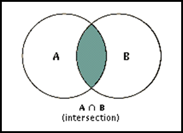
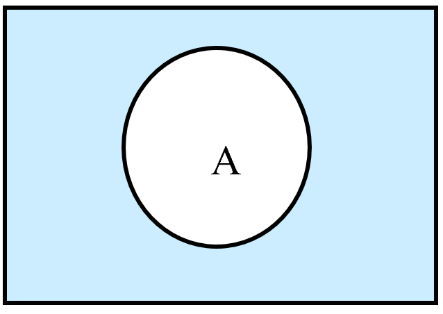

 Chaptcer 02 Basic Structures 基本结构

Part 01 Set

Covering2.1 ~ 2.2

------

# Set 集合

## Basic 基本属性

### Definition 定义

A set is an **unordered** collection of objects. 

集合是对象的一个无序聚集。

> **Note**:
>
> - The Order of elements does not matter {1, 2, 3} = {3, 2, 1}
> - Repetition of elements does not matter {1, 1, 2, 3, 3} = {1, 2, 3} 

The objects in a set are called the **elements**（元素）, or **members**（成员）, of the set.

A set is said to **contain**（包含） its elements.

> **Note:**
>
> 1. Uppercase letters are usually used to denote sets, and lowercase letters are usually used to denote elements of sets.
>
> 2. a ∈ A:  a is a member (an element) of the set A
>
>    a ∉ A:  a is not an element of the set A
>

### Description 描述方法

#### Roster Method 花名册法

listing all its members between braces

e.g. *S = {a, b, c, d}*

##### Brace Notation with Ellipses 省略号记法

Sometimes the roster method is used to describe a set without listing all its members. Some members of the set are listed, and then ellipses (. . .) are used when the general pattern of the elements is obvious.

e.g. The set *S* of positive integers less than 100 can be denoted by *S = {1, 2, 3, . . . , 99 }*

#### Set Builder 构造器

We characterize all those elements in the set by stating the property or properties they must have to be members.

e.g.  *{x | x is an odd positive integer less than 10}*

##### Truth Sets 真值集

Given a predicate P, and a domain D, we define the truth set of P to be the set of elements x in D for which P(x) is true. 

The truth set of P(x) is denoted by {x ∈ D | P(x)}.

### Venn Diagrams 文氏图

- In Venn diagrams, the universal set *U* is represented by a rectangle.
- Inside this rectangle, circles or other geometrical figures are used to represent sets.
- Points are used to represent the particular elements of the set.

## Property 性质

### The  Relations Between Two Sets 集合间的关系

#### Subset 子集

$A ⊆ B ⇔ ∀x(x ∈ A → x ∈ B)​$

> For any set A
>
> - $\phi ⊆A$
>
> - $A⊆A​$ 

#### Equal 相等

$A=B\\⇔∀x[(x∈A→x∈B)∧(x∈B→x∈A)]\\⇔(A⊆B)∧(B⊆A)$

> To show that two sets A and B are equal, show that A ⊆ B and B ⊆ A.

#### Proper subset 真子集

$A⊂B\\⇔∀x(x∈A→x∈B)∧∃x(x∈B∧x∉A)\\⇔(A⊆B)∧(A≠B)$

### The Size of a Set 集合的大小

Let S be a set. If there are **exactly** n distinct elements in S where n is a nonnegative integer, we say that S is a **finite**（有限的） set and that n is the **cardinality**（基数） of S.

**Notation**: |S| ->  the cardinality of S

e.g. Let A be the set of odd positive integers less than 10. Then |A| = 5.

​	|∅| = 0

> A set is said to be **infinite**（无限的） if it is **not finite**
>
> e.g. The set of positive integers is infinite

### Power Set 幂集

Given a set S, the **power set** of S is the set of all subsets of the set S.

**Notation**: P(S) -> the power set of S

> Note:
>
> 1. |S|=n implies |P(S)| = $2^n​$
> 2. S is finite and so is P(S)
> 3. $x∈P(S)⇒x⊆S（此处x是一个集合）\\x∈S⇒\{x\}∈P(S)（此处x是一个元素）\\S∈P(S)$

> e.g.
>
> What is the power set of the empty set? What is the power set of the set {∅}?
>
> The empty set has exactly one subset, namely, itself. Consequently,
> P(∅) = {∅}.
> The set {∅} has exactly two subsets, namely, ∅ and the set {∅} itself. Therefore,
> P({∅}) = {∅, {∅}}.
>
> ***A good way to check is to make sure |P(S)| = $2^n$***

### Cartesian Products 笛卡尔积

#### Tuple 元组

The **ordered n-tuple**（有序n元组） (a1, a2, . . . , an) is the ordered collection that has a1 as its first element, a2 as its second element, . . . , and an as its n-th element.

In particular, **ordered 2-tuples** are called **ordered pairs**（序偶）

> $(x,y)=(u,v)⇒(x=u)∧(y=u)$
>
> If $x≠y$, then $(x,y)≠(y,x)$

The Cartesian product of A and B, denoted by A × B, is the set of all ordered pairs (a, b), where a ∈ A and b ∈ B. 

$A × B = \{(a, b) | a ∈ A ∧ b ∈ B\}$

$A_1 × A_2 ×· · ·×A_n = \{(a_1, a_2, . . . , a_n) | a_i ∈ A_i\ for\ i = 1, 2, . . . , n\}$

> **Note**:
>
> If |A|=m, |B|=n, then |A×B|=|B×A|=mn
>
> A×B≠B×A
>
> A×∅ = ∅×A = ∅

## Set Operations 集合运算

### Intersection 交集

$A∩B=\{x|x∈A∧x∈B\}​$

> Two sets are called *disjoint* if their intersection is the empty set, namely $A∩B = Ø$

#### Generalized Intersections 拓展的交集

$A_1∩A_2∩...∩A_n=\bigcap_{i=1}^{n}A_i$

### Union 并集

$A∪B=\{x|x∈A∨x∈B\}​$

> The cardinality of the union of two finite sets:
>
> $|A∪B|=|A|+|B|-|A∩B|$

#### Generalized Unions 拓展的并集

$A_1∪A_2∪...∪A_n=\bigcup_{i=1}^{n}A_i$

### Difference 差集

$A-B=\{x|x∈A∧x∉B\}​$

### Complement 补集

$\overline{A} = {x ∈ U | x ∉ A}​$

(U is the universal set)

> **Note**:
>
> $A-B=A∩\overline{B}​$

### Symmetric Difference 对称差分

$A⊕B=(A∪B)-(A∩B)​$

## Set Identities 集合恒等式

|                       Identity 恒等式                        |         Name 名称          |
| :----------------------------------------------------------: | :------------------------: |
|                    $A ∩ U = A\\A ∪ ∅ = A$                    |    Identity laws 恒等率    |
|                     $A ∪ U = U\\A∩∅ = ∅$                     |   Domination laws 支配率   |
|                    $A ∪ A = A\\A ∩ A = A$                    |   Idempotent laws 幂等律   |
|                 $\overline{\overline{A}}=A$                  |  Complementation law 补率  |
|                $A ∪ B = B ∪ A\\A ∩ B = B ∩ A$                |  Commutative laws 交换律   |
|    $A ∪ (B ∪ C) = (A ∪ B) ∪ C\\A ∩ (B ∩ C) = (A ∩ B) ∩ C$    |  Associative laws 结合律   |
| $A ∪ (B ∩ C) = (A ∪ B) ∩ (A ∪ C)\\A ∩ (B ∪ C) = (A ∩ B) ∪ (A ∩ C)$ |  Distributive laws 分配律  |
| $\overline{A ∩ B} = \overline{A} ∪ \overline{B}\\\overline{A ∪ B} = \overline{A} ∩ \overline{B}$ | De Morgan’s laws 德·摩根率 |
|              $A ∪ (A ∩ B) = A\\A ∩ (A ∪ B) = A$              |   Absorption laws 吸收率   |
|         $A ∪ \overline{A} = U\\A ∩ \overline{A} = ∅$         |   Complement laws 互补率   |

### Ways to Prove Set Identities 集合恒等式的证明方法

#### I. Show that A ⊆ B and that B ⊆ A

> **New and important**

#### II. Use logical equivalences to prove equivalent set definitions

> **Easy but tedious**

#### III. Use a membership table

> **Like truth tables**

#### IV. Use previously proven identities

> **Like ≡**

## Computer Representation of Set 集合的计算机表示

Using bit strings to represent sets

1. Specify an arbitrary ordering of the elements of *U*, for instance $a_1,a_2,...,a_n$
2. Represent a subset *A* of *U* with the bit string of length n, where the i-th bit is 1 if $a_i$ belongs to *A* and is 0 if $a_i$ does not belong to *A*.
3. Thus, **Union -> bitwise OR** **Intersection -> bitwise AND**

> **Example**:
>
> Let *U* ={1, 2, 3, 4, 5,6,7,8,9}, *A*={1, 2, 3, 4, 5}, *B*= (1, 3, 5, 7, 9). 
>
> The bit string for the set *A*: 11 1110 000
>
> The bit string for the set *B*: 10 1010 101

