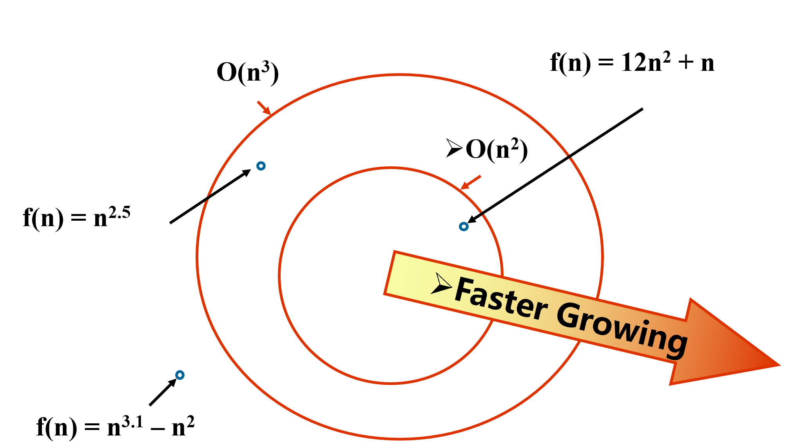
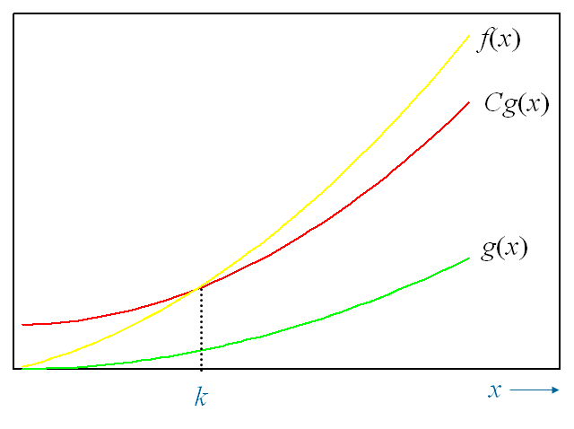

<font size=6> Chaptcer 03 Algorithms 算法</font>

covering 3.1~3.3

------

# Definition 定义

An **algorithm** is a **finite** set of precise instructions for performing a computation or for solving a problem.

**Pseudocode**（伪代码）: Instructions given in a generic language similar to a computer language such as C++ or Pascal.

e.g. A pseudocode description of the algorithm for finding the maximum element in a finite sequence follows.

```pseudocode
procedure  max(a1, a2, ..., an :integers)
max := a1
for i := 2 to n
	if max < ai then max:= ai
return max{max is the largest element}
```

# Properties 属性

- Input : An algorithm has input values from a specified set.

- Output : From each set of input values, an algorithm produces output values from a specified set.

- Definiteness : The steps of an algorithm must be defined precisely.

- Correctness : An algorithm should produce the correct output values for each set of  input values.

- Finiteness : An algorithm should produce the desired output after a finite number of steps for any input in the set.

- Effectiveness: Each step of an algorithm must be executed exactly and in a finite amount of time.

- Generality : The procedure should be applicable for all problems of the desired form, not just for a particular set of input values.

# Examples 算法举例

## Searching Algorithms 查找算法

### Linear Search or sequential search 线性查找

### Binary Search 二分查找

## Sorting 排序算法

## Optimization problem 最优化问题

### Greedy Algorithm 贪心算法

Algorithms that make what seems to be “best” choice at each step

# Halting Problem 停机问题

Can we develop a procedure that takes as input a computer program along with its input and determines whether the program will eventually halt with that input.


# The Growth of Functions 函数的增长

> Factors to be considered for choosing an algorithm
>
> - Simplicity - Easy to implement and obviously correct
> - Clarity - Easy to read and to maintain
> - Extensibility - Can easily be extended to new tasks
> - Reusability - Can be adapted to different tasks
> - Efficiency - Uses time and space well (computation complexity)

## Asymptotic Running Time 渐进运行时间

A rough measurement of the running  time of an algorithm based on the **input size**

- Gives you the relative rate of growth but not specific time of execution

- Allows for comparison of algorithms without implementation

- Not hardware specific

**Asymptotic running time** : the number of operations used by the algorithm as the input size approaches infinity

## Big-O Notation 大O记号

“f(x) is O(g(x))” if there are constants *C* and *k* such that |*f*(*x*)| ≤ *C| g*(*x*)| whenever *x* > *k*.

The constants C and k in the definition of big-O notation are called **witnesses**（**凭证**） to the relationship f (x) is O(g(x)).


> 1. Equivalent expressions: $$f(x)=O(g(x))$$ $$f(x)\in O(g(x))$$
> 2. The pair (C,k) is **never** unique
> 3. When f(x) is O(g(x)) , and h(x) is a function that has larger absolute values than g(x) does for sufficiently large values of x, it follows that f(x) is O(h(x)) 



> If we have two standards, then two functions f(x) and g(x) that satisfy both of these big-O relationships are of the same order.

> if a is the Big-O of b, then b grows faster.

### Some Important Big-O Results

Let $$f(x)=a_nx^n+a_{n-1}x^{n-1}+...+a_1x+a_0$$, where $$a_i(i=1,2,3,...)$$ are real numbers, then f(x) is $$O(x^n)$$


## Growth of Combinations of Functions

### Addition of functions

If $$f_1(x)$$ is $$O(g_1(x))$$ and  $$f_2(x)$$ is $$O(g_2(x))$$, then  $$(f_1+f_2)(x)$$  is  $$O(max(g_1(x),g_2(x)))$$

### Multiplication of functions

If $$f_1(x)$$ is $$O(g_1(x))$$ and  $$f_2(x)$$ is $$O(g_2(x))$$, then $$(f_1f_2)(x)$$ is $$O(g_1(x)g_2(x))$$

## Big-Omega and Big-Theta Notation

$$f(x)$$ is $$\Omega(g(x))$$ if there are constants *C* and *k* such that $$|f(x)|\geq C|g(x)|$$ whenever *x* > *k*.



$$f(x)$$ is $$\Theta(g(x))$$ if $$f(x)$$ is $$O(g(x))$$ and $$f(x)$$ is $$\Omega(g(x))$$

> $$f(x)$$ is $$\Theta(g(x))$$ when there are real numbers $$C_1$$ and $$C_2$$ and a positive real number *k* such that
>
> $$C_1|g(x)|\leq|f(x)|\leq C_2|g(x)|$$


# Complexity of Algorithms 算法复杂度

## Space Complexity 空间复杂度

Gives the approximate amount of memory required to solve a problem of size n.

Often tied in with the particular data structures used to implement the algorithm

## Time Complexity 时间复杂度

Gives the approximate number of operations required to solve a problem of size n.

## Different types of analysis 复杂度分析

### Worst-case analysis 最坏情形

- Maximum number of operations

- Is a guarantee over all inputs of a given size

### Best-case analysis 最好情形

- Minimum number of operations

- Not very practical

### Average-case analysis 平均情形

- Average number of operations assuming an input probability distribution

- An average over all the possible inputs of a given size

- Can be complicated

# Understanding the complexity of algorithm

**Tractable**（**易解的**）: A problem is solvable using an algorithm with polynomial worst-case complexity. 

**Intractable**（**难解的**）: A problem cannot be solved using an algorithm with worst-case polynomial time complexity.

**Solvable**（**可解**）

**Unsolvable**（**不可解**）: Some problems even exist for which it can be shown that no algorithm exists for solving them. 

## P&NP

**Class P**（**P类问题**）: tractable problems

**Class NP** (nondeterministic polynomial time（非确定性多项式时间）)（**NP类**）: problems for which a solution can be checked in polynomial time. 

**NP-complete**（**NP完全问题**）:  an important class of problems with the property that if any of these problems can be solved by a polynomial worst-case time algorithm, then all can be solved by polynomial worst-case time algorithms.

**The P versus NP problem**（**P与NP问题**） asks whether NP, the class of problems for which it is possible
to check solutions in polynomial time, equals P, the class of tractable problems. If P=NP, there
would be some problems that cannot be solved in polynomial time, but whose solutions could
be verified in polynomial time.

> P与NP问题有点类似非对称加密，无法直接解密，但是可以快速验证答案真伪

|     Complexity      |              Terminology               |
| :-----------------: | :------------------------------------: |
|     $$\Theta(1)$$     |     Constant complexity 常量复杂度     |
|  $$\Theta(log\ n)$$   |   Logarithmic complexity 对数复杂度    |
|     $$\Theta(n)$$     |      Linear complexity 线性复杂度      |
| $$\Theta(n\ log\ n)$$ | Linearithmic complexity 线性对数复杂度 |
|    $$\Theta(n^b)$$    |   Polynomial complexity 多项式复杂度   |
|  $$\Theta(b^n),b>1$$  |   Exponential complexity 指数复杂度    |
|    $$\Theta(n!)$$     |    Factorial complexity 阶乘复杂度     |

